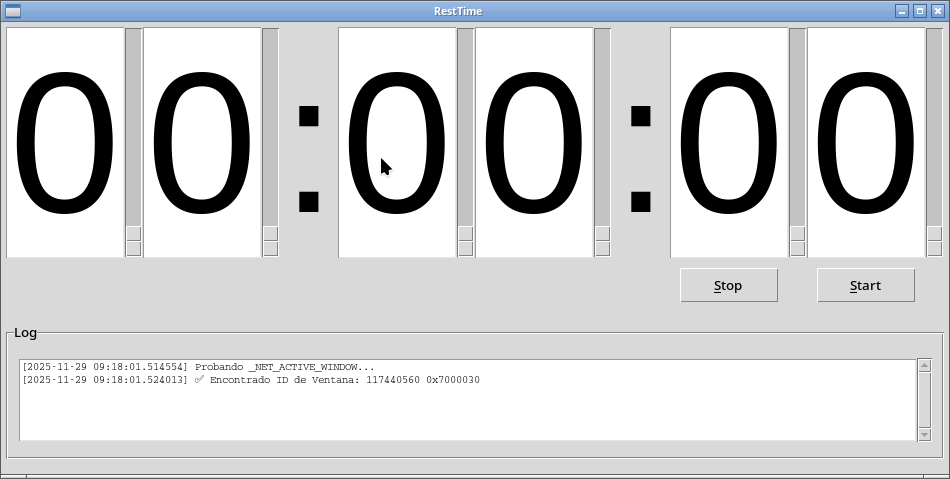

# resttime-py

## Getting started

No need install program. Only you need to install with pip: tkinter, tempfile, uuid, os, time, Xlib, mpv, datetime if you don't have installed.

To run:
$ python resttime.py

## Name

RestTime v1.00

## Description

Is a countdown timer at end demands attention.

## Visuals

## Installation

No need to install program. Only you need to install with pip: tkinter, tempfile, uuid, os, time, Xlib, mpv, datetime if you don't have some of them installed.

## Usage

Write down time and press Start.

## Support

I welcome any improvements.

## Roadmap

## Contributing

I welcome any improvements.

## Authors and acknowledgment

Óscar Megía López

## License

GNU Public License Version 3 GPLv3

## Project status

Finished. v1.00