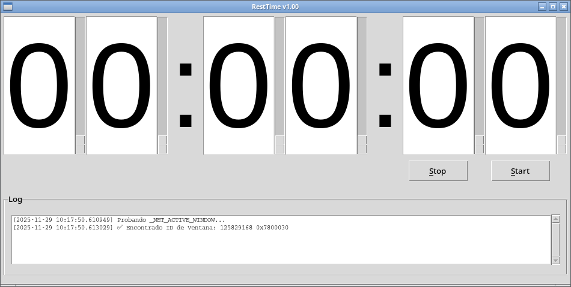

# resttime-py

## Getting started

Clone this repository and follow installation help here down.

## Name

RestTime v1.01

## Description

Is a countdown timer at end demands attention. It uses Xlib APIs _NET_ACTIVE_WINDOW to get window ID
and _NET_WM_STATE_DEMANDS_ATTENTION to get window's attention on Linux and
Windows APIs FlashWindowEx, GetParent, GetDesktopWindow and SetForegroundWindow.

Also at beggining center window on screen.

I developed it to don't stay many hours in front computer without rest. To get a notice after the time preselected.

## Visuals



## Installation

You need to have installed python3.

You only need to install imports with pip: tkinter, os, Xlib (only for Linux), mpv, ctypes (only for Windows) or datetime if you don't have some of them installed.

If you don't have installed mpv don't install library mpv.

Example:

```bash
$ python3 -m venv venv

$ source venv/bin/activate

[venv] $ pip install tkinter

[venv] $ python restime.py

[venv] $ deactivate

$
```

To run:

```bash
$ python resttime.py
```

## Usage

Type time you want and press Start button. If you want to stop click on stop button.

When time end it will play two sounds and window on taskbar will start to flash until get focus.

## Support

I welcome any improvements.

## Roadmap

## Contributing

I welcome any improvements.

## Authors and acknowledgment

Óscar Megía López

## License

GNU Public License Version 3 GPLv3

## Project status

v1.01 Works on Linux and Windows.